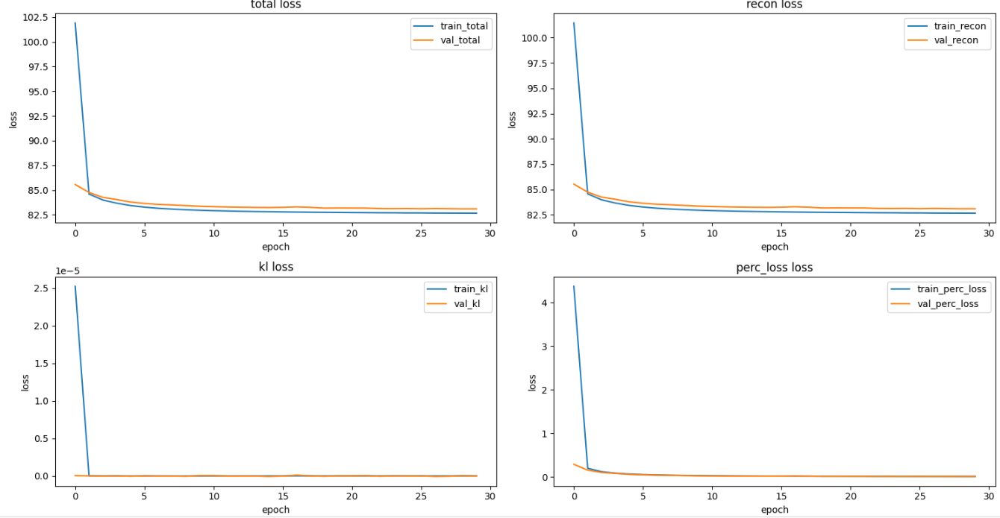
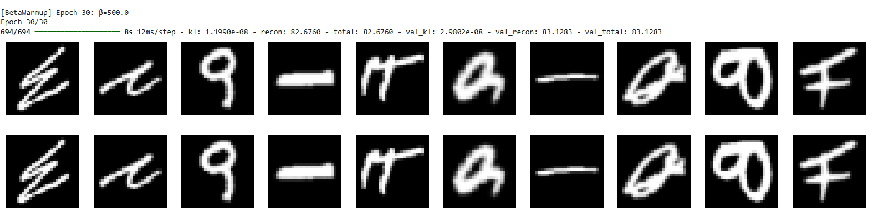

# Perceptual--VAE-for-Handwritten-Letters

# 1. 下載 EMNIST letters 資料集

```
(ds_train, ds_test), ds_info = tfds.load(
    'emnist/letters',
    split=['train', 'test'],
    shuffle_files=True,
    as_supervised=True,
    with_info=True,
)
```

使用 tensorflow_datasets 下載 EMNIST 字母手寫圖像資料集，分為訓練集和測試集。


# 2. 預處理: 正規化

```
def preprocess(image, label):
    image = tf.cast(image, tf.float32) / 255.0  # 正規化到0~1
    return image, image

ds_train = ds_train.map(preprocess).batch(128).prefetch(tf.data.AUTOTUNE)
ds_test  = ds_test.map(preprocess).batch(128).prefetch(tf.data.AUTOTUNE)
```

將每個像素值正規化到 [0,1] 範圍。
輸出的 label 被設成和 image 一樣（自編碼器目標是重建自己）。


# 3. 感知模型（Perceptual Model）

```
vgg = tf.keras.applications.VGG16(
    include_top=False, weights='imagenet', input_shape=(32,32,3)
)
vgg.trainable = False
perceptual_layer = tf.keras.Model(
    inputs=vgg.input,
    outputs=vgg.get_layer('block3_conv3').output
)
```

這裡用 VGG16 的中層卷積特徵 (block3_conv3) 來當作感知損失的特徵空間。
用預訓練的 VGG16，因此不會更新 VGG16 權重。
EMNIST 是灰階 28x28，VGG16 要 32x32 的 RGB，稍後會在損失計算時轉換。


# 4. Encoder + Decoder 架構

### 4.1 Encoder

```
class Encoder(layers.Layer):
    def __init__(self, latent_dim):
        super().__init__()
        self.conv1 = layers.Conv2D(32, 3, strides=2, padding='same', activation='relu')
        self.conv2 = layers.Conv2D(64, 3, strides=2, padding='same', activation='relu')
        self.conv3 = layers.Conv2D(128, 3, strides=2, padding='same', activation='relu')
        self.flatten = layers.Flatten()
        self.fc = layers.Dense(256, activation='relu')
        self.z_mean = layers.Dense(latent_dim)
        self.z_log_var = layers.Dense(latent_dim)

    def call(self, x):
        skips = []
        x = self.conv1(x); skips.append(x)
        x = self.conv2(x); skips.append(x)
        x = self.conv3(x)
        x = self.flatten(x)
        x = self.fc(x)
        z_mean = self.z_mean(x)
        z_log_var = self.z_log_var(x)
        eps = tf.random.normal(shape=tf.shape(z_mean))
        z = z_mean + tf.exp(0.5 * z_log_var) * eps
        return z, z_mean, z_log_var, skips
```

三層卷積，並將輸出一路存下來當作 skip-connection
flatten後再進入 Dense
最後產生 z_mean 與 z_log_var，用來做 reparameterization trick 得到潛在向量 z

### 4.2 Decoder

```
class Decoder(layers.Layer):
    def __init__(self):
        super().__init__()
        self.fc = layers.Dense(4*4*128, activation='relu')
        self.reshape_layer = layers.Reshape((4,4,128))
        self.up1 = layers.Conv2DTranspose(128, 3, strides=2, padding='same', activation='relu')
        self.up2 = layers.Conv2DTranspose(64, 3, strides=2, padding='same', activation='relu')
        self.up3 = layers.Conv2DTranspose(32, 3, strides=2, padding='same', activation='relu')
        self.crop = layers.Cropping2D(((2,2),(2,2)))
        self.out_conv = layers.Conv2D(1, 3, padding='same', activation='sigmoid')

    def call(self, z, skips):
        x = self.fc(z)
        x = self.reshape_layer(x)
        x = self.up1(x)
        skip1 = tf.pad(skips[-1], [[0,0],[0,1],[0,1],[0,0]])
        x = tf.concat([x, skip1], axis=-1)
        x = self.up2(x)
        skip2 = tf.pad(skips[-2], [[0,0],[1,1],[1,1],[0,0]])
        x = tf.concat([x, skip2], axis=-1)
        x = self.up3(x)
        x = self.crop(x)
        return self.out_conv(x)
```

用全連接層還原成 feature map
三次 Conv2DTranspose 上採樣（與 Encoder 鏈接 skip）
用 Cropping 裁掉多餘 padding
最後輸出單通道的圖像 (28x28x1)
這設計像簡化版 U-Net


# 5. β-VAE with Perceptual Loss

```
class VAE(Model):
    ...
    def compute_loss(self, x):
        # Encode
        z, zm, zv, skips = self.encoder(x)
        # Decode
        xr = self.decoder(z, skips)
        # Reconstruction loss (像素級)
        recon = ...
        # KL loss (正則化潛在空間，逼近標準常態)
        kl = ...
        # Perceptual loss (VGG16特徵空間距離)
        ...
        # total loss
        loss = recon + self.beta * kl + self.perc_weight * perc_loss
        return loss, recon, kl, perc_loss
```

重建損失（recon loss）：像素級 Binary Crossentropy。
KL 損失：控制潛在空間的分布接近標準常態 N(0,1)，這是 VAE 的核心。
感知損失（perceptual loss）：將真實和重建圖片都轉成 VGG16 特徵空間，比較他們的特徵差距。這讓重建圖像不只學到像素，更學到「感覺上」像不像。
total loss = recon + β × KL + 感知損失加權 (β預設為500)
透過 beta 控制 VAE 的解耦性、潛在空間規範強度。perc_weight 調節感知損失影響。


# 6. 訓練

```
vae.fit(
    ds_train,
    epochs=30,
    validation_data=ds_test
)
```

# 7. 畫 loss 曲線

這裡用 fit 得到 history 之後，把 training 跟 validation 的 loss（total、recon、kl、perc_loss）都畫出來：

```
loss_keys = ['total', 'recon', 'kl', 'perc_loss']
plt.figure(figsize=(15, 8))
for i, key in enumerate(loss_keys):
    plt.subplot(2, 2, i + 1)
    plt.plot(history.history[key], label=f"train_{key}")
    plt.plot(history.history['val_' + key], label=f"val_{key}")
    plt.title(f"{key} loss")
    plt.xlabel("epoch")
    plt.ylabel("loss")
    plt.legend()
plt.tight_layout()
plt.show()
```



total：總損失（模型真正優化的目標）
recon：重建誤差（像素層級，有助於圖像清晰度）
kl：潛在空間的正則化（避免 z 的分布太亂）
perc_loss：感知損失（讓重建圖「感覺」更像）


# 8. 可視化

```
for test_batch, _ in ds_test.take(1):
    z, _, _, s = vae.encoder(test_batch)
    recon = vae.decoder(z, s)
    plt.figure(figsize=(20,4))
    for i in range(10):
        ax = plt.subplot(2,10,i+1)
        plt.imshow(test_batch[i].numpy().squeeze(), cmap='gray'); plt.axis('off')
        ax = plt.subplot(2,10,i+11)
        plt.imshow(recon[i].numpy().squeeze(), cmap='gray'); plt.axis('off')
    plt.show()
```



顯示前10個測試集樣本的原圖（上排）與重建圖（下排），評估 VAE 表現。
